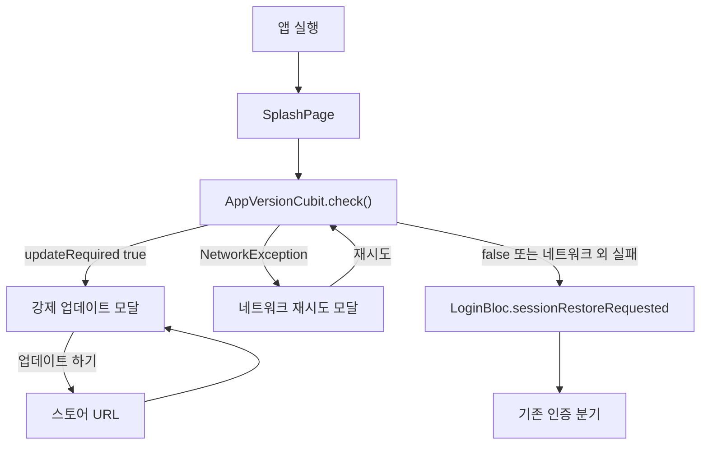

# TDD — 앱 버전 강제 업데이트 기술 설계 문서

---

## 메타 정보

| 항목 | 내용 |
|------|------|
| 기능 ID | `feature/app-version` |
| 작성자 | ahndohyeon |
| 작성일 | 2026-07-28 |
| 상태 | Approved |
| 관련 PRD | `prd.md` |

---

## 1. 기능 요약

앱 실행 직후 스플래시에서 현재 OS·앱 버전으로 최소 지원 여부를 조회한다. 업데이트가 필요하면 닫을 수 없는 모달로 스토어 이동만 허용하고, 네트워크 오류 시에는 재시도 모달로 막으며, 그 외 조회 실패 시에는 세션 복원을 그대로 진행한다.

**피처 경로**: `lib/features/app_version/`

---

## 2. 전체 데이터 흐름

```
[앱 실행 / SplashPage]
    ↓
[AppVersionCubit.check()]
    ↓
[CheckAppVersionUseCase]
    ↓
[AppVersionRepositoryImpl]
    ├─ AppInfoDatasource → OS + PackageInfo.version
    └─ AppVersionRemoteDatasource → GET /v1/app-versions/{os}?version=
    ↓
[AppVersionCheck entity]
    ↓
[AppVersionCubit]
    ├─ updateRequired → SsossApp 강제 모달 (세션 복원 안 함)
    ├─ networkUnavailable → SsossApp 재시도 모달 (세션 복원 안 함)
    └─ allowed (false 또는 네트워크 외 조회 실패) → LoginBloc.sessionRestoreRequested
```



---

## 3. Domain 레이어

### 3.1 Entities

| 파일 경로 | 클래스명 | 설명 |
|-----------|---------|------|
| `domain/entities/app_version_check.dart` | `AppVersionCheck` | 최소 지원 버전 + 업데이트 필요 여부 |

```dart
class AppVersionCheck {
  const AppVersionCheck({
    required this.minimumVersion,
    required this.updateRequired,
  });

  final String minimumVersion;
  final bool updateRequired;
}
```

### 3.2 Repository 인터페이스

| 파일 경로 | 인터페이스명 | 메서드 |
|-----------|------------|--------|
| `domain/repositories/app_version_repository.dart` | `AppVersionRepository` | `Future<AppVersionCheck> checkCurrentVersion()` |

### 3.3 Use Cases

| 파일 경로 | 클래스명 | 입력 | 출력 |
|-----------|---------|------|------|
| `domain/usecases/check_app_version_usecase.dart` | `CheckAppVersionUseCase` | 없음 | `Future<AppVersionCheck>` |

---

## 4. Data 레이어

### 4.1 Models

| 파일 경로 | 클래스명 |
|-----------|---------|
| `data/models/app_version_response_model.dart` | `AppVersionResponseModel` (`minimumVersion`, `updateRequired`) |

### 4.2 Datasources

| 파일 경로 | 역할 |
|-----------|------|
| `data/datasources/app_info_datasource.dart` | `Platform.isIOS` → `IOS`/`ANDROID`, `PackageInfo.version` |
| `data/datasources/app_version_remote_datasource.dart` | `GET /v1/app-versions/{os}?version=` + `skipAuth` |

### 4.3 Repository 구현

`AppVersionRepositoryImpl`이 로컬 앱 정보를 읽어 원격 API를 호출하고 model → entity 변환한다.

---

## 5. Presentation 레이어

### 5.1 Cubit / State

| 상태 | 의미 |
|------|------|
| `checking` | 조회 중 (스플래시 유지) |
| `updateRequired` | 강제 업데이트 필요 |
| `networkUnavailable` | 네트워크 오류 — 재시도 모달 |
| `allowed` | 이용 가능 또는 네트워크 외 조회 실패(소프트 통과) |

### 5.2 Providers

`AppVersionProviders.build()` → `SsossAppScope`에 등록.

### 5.3 부트스트랩

`LoginBloc` 생성 시 `sessionRestoreRequested`를 즉시 보내지 않는다.
`AppVersionCubit`이 `allowed`를 emit하면 그때 세션 복원을 시작한다.
`updateRequired`면 `SsossApp`에서 강제 모달을 표시한다.
`networkUnavailable`이면 `SsossApp`에서 재시도 모달을 표시한다. `재시도`는 모달을 닫고 `AppVersionCubit.check()`를 다시 호출하며, 또 실패하면 모달을 다시 띄운다.

---

## 6. 설계 결정

| 결정 | 선택 | 이유 |
|------|------|------|
| 상태 관리 | Cubit | 단일 비동기 체크, 이벤트 분기 불필요 |
| 세션 복원 게이트 | 버전 체크 후 지연 | 라우터는 `LoginInitial`로 스플래시 유지 |
| 네트워크 오류 | `networkUnavailable` + 재시도 모달 | PRD FR-06/FR-07 — 연결 복구 후 재조회 |
| 그 외 조회 실패 | `allowed`로 취급 | PRD FR-08 — 사용자를 막지 않음 |
| 모달 닫기 | `showCloseButton: false`, barrier 비해제, pop 안 함 | 강제 업데이트 |
| 스토어 URL | `AppUrls` 상수 | iOS Apple ID / Android package 확정 |

---

## 7. API

- Method/Path: `GET /v1/app-versions/{os}`
- Query: `version` (semver)
- Path `os`: `IOS` | `ANDROID`
- Auth: 없음 (`AuthRequestExtra.skipAuth`)
- 200: `{ minimumVersion, updateRequired }`
