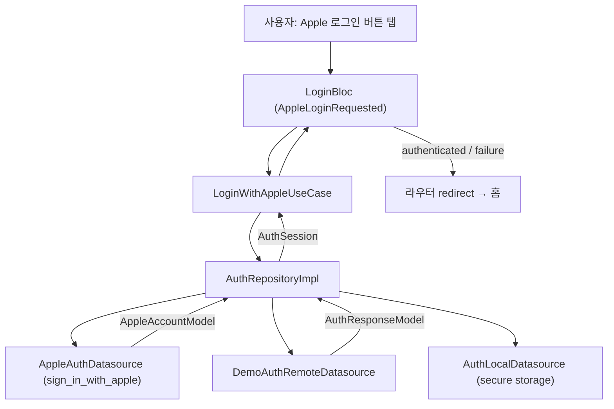

# TDD — 애플 로그인 기술 설계 문서

---

## 메타 정보

| 항목 | 내용 |
|------|------|
| 기능 ID | `feature/auth-apple-login` |
| 작성자 | ahndohyeon |
| 작성일 | 2026-07-07 |
| 상태 | Draft |
| 관련 PRD | `prd.md` |

> **구현 경로**: 문서는 `docs/specs/auth/apple-login/` 에 분리되어 있으나, 코드는 네이버 로그인과 동일하게 `lib/features/auth/` 피처 내에서 provider 추상화로 확장한다.

---

## 1. 기능 요약

Apple ID 기반 소셜 로그인을 제공한다. `sign_in_with_apple` 패키지로 Apple 인증을 수행해 credential(identityToken, authorizationCode, userIdentifier 등)을 획득하고, 데모 단계에서는 `DemoAuthRemoteDatasource` 로 로컬 JWT(access/refresh) 세션을 생성한다. 백엔드 연동(Phase 7) 시 credential을 자체 백엔드에 전달하여 자체 JWT를 발급받는다. 발급받은 토큰과 provider·프로필 정보는 secure storage에 저장하며, 앱 재실행 시 저장된 세션으로 자동 로그인을 수행한다.

**피처 경로**: `lib/features/auth/`

---

## 2. 전체 데이터 흐름

```
[사용자: Apple 로그인 버튼 탭]
    ↓
[LoginPage / AppleLoginButton]  →  LoginBloc.add(AppleLoginRequested())
    ↓
[LoginBloc]   →  LoginWithAppleUseCase() 호출, 상태 loading emit
    ↓
[LoginWithAppleUseCase]  →  AuthRepository.loginWithApple()
    ↓
[AuthRepositoryImpl]
    ├─ AppleAuthDatasource.login()              → Apple 인증, AppleAccountModel 획득
    ├─ DemoAuthRemoteDatasource.createSessionFromApple()  → (데모) 로컬 JWT 세션 생성
    │   또는 AuthRemoteDatasource.socialLogin() → (Phase 7) 백엔드에 credential 전달
    └─ AuthLocalDatasource.saveSession()        → secure storage에 토큰+provider+프로필 저장
    ↓
[AuthSession(User + AuthTokens)] 반환
    ↓
[LoginBloc]   →  authenticated(user) 상태 emit (실패 시 catch → failure emit)
    ↓
[LoginPage / 라우터 redirect]  →  홈 화면 이동
```



---

## 3. Domain 레이어

> 순수 Dart 코드만 사용한다. Flutter, Dio, sign_in_with_apple, secure storage 등 외부 라이브러리에 의존하지 않는다.

### 3.1 Entities

| 파일 경로 | 클래스명 | 설명 |
|-----------|---------|------|
| `domain/entities/user.dart` | `User` | 인증된 사용자 정보 (기존, 변경 없음) |
| `domain/entities/auth_tokens.dart` | `AuthTokens` | 자체 JWT access/refresh 토큰 (기존) |
| `domain/entities/auth_session.dart` | `AuthSession` | 로그인 결과 (User + AuthTokens) (기존) |
| `domain/entities/social_provider.dart` | `SocialProvider` | 소셜 로그인 제공자 enum — **`apple` 추가** |

**Entity 변경 사항**

```dart
// social_provider.dart — apple 추가
enum SocialProvider { naver, apple }

// user.dart, auth_tokens.dart, auth_session.dart — 필드 변경 없음
```

### 3.2 Repository 인터페이스

> 프로젝트는 `dartz`/`fpdart` 를 사용하지 않는다. 실패는 예외(throw)로 전달하고, 반환 타입은 순수 Entity 를 사용한다 (7. 에러 처리 전략 참조).

| 파일 경로 | 인터페이스명 | 메서드 |
|-----------|------------|--------|
| `domain/repositories/auth_repository.dart` | `AuthRepository` | `loginWithNaver`, **`loginWithApple`**, `logout`, `withdraw`, `restoreSession`, `refreshTokens` |

```dart
abstract class AuthRepository {
  Future<AuthSession> loginWithNaver();

  /// Apple 인증 → (데모) 로컬 JWT / (Phase 7) 백엔드 JWT 발급 → 토큰 저장 후 세션 반환.
  Future<AuthSession> loginWithApple();

  /// 앱 로그아웃: 로컬 세션만 삭제한다. (소셜 연동 해제 없음)
  Future<void> logout();

  /// 회원 탈퇴: 로컬 세션/토큰 정리.
  /// 소셜 연동 revoke(naver/apple)는 서버에서 처리 (Phase 7 withdraw API).
  /// 백엔드 연동 시 withdraw API 호출을 포함한다.
  Future<void> withdraw();

  Future<AuthSession?> restoreSession();

  Future<AuthTokens> refreshTokens();
}
```

### 3.3 Use Cases

| 파일 경로 | 클래스명 | 입력 | 출력 |
|-----------|---------|------|------|
| `domain/usecases/login_with_naver_usecase.dart` | `LoginWithNaverUseCase` | 없음 | `Future<AuthSession>` |
| `domain/usecases/login_with_apple_usecase.dart` | **`LoginWithAppleUseCase`** | 없음 | `Future<AuthSession>` |
| `domain/usecases/logout_usecase.dart` | `LogoutUseCase` | 없음 | `Future<void>` |
| `domain/usecases/withdraw_usecase.dart` | `WithdrawUseCase` | 없음 | `Future<void>` |
| `domain/usecases/restore_session_usecase.dart` | `RestoreSessionUseCase` | 없음 | `Future<AuthSession?>` |

> `refreshTokens` 는 토큰 갱신 인터셉터/리프레시 흐름에서 Repository 를 직접 사용하므로 별도 UseCase 로 노출하지 않는다(설계 결정 참조).

---

## 4. Data 레이어

> Model/DTO 타입은 domain 또는 presentation 으로 노출하지 않는다. Repository 구현체에서 Entity 로 변환한다.

### 4.1 Models (DTO)

| 파일 경로 | 클래스명 | 대응 Entity | 직렬화 방식 |
|-----------|---------|------------|-----------|
| `data/models/apple_account_model.dart` | **`AppleAccountModel`** | (SDK 결과 전용) | plain class |
| `data/models/stored_auth_cache_model.dart` | **`StoredAuthCacheModel`** | (로컬 세션 캐시) | `@freezed` + `@JsonSerializable` |
| `data/models/user_model.dart` | `UserModel` | `User` | `@freezed` + `@JsonSerializable` (**`toEntity(SocialProvider)` 수정**) |
| `data/models/auth_token_model.dart` | `AuthTokenModel` | `AuthTokens` | `@freezed` + `@JsonSerializable` |
| `data/models/social_login_request.dart` | `SocialLoginRequest` | (요청 전용) | `@freezed` + `@JsonSerializable` (**Apple 필드 Phase 7 확장**) |
| `data/models/auth_response_model.dart` | `AuthResponseModel` | `AuthSession` | `@freezed` + `@JsonSerializable` |

**신규 Model 정의**

```dart
// data/models/apple_account_model.dart
class AppleAccountModel {
  const AppleAccountModel({
    required this.userIdentifier,
    this.identityToken,
    this.authorizationCode,
    this.email,
    this.givenName,
    this.familyName,
  });

  final String userIdentifier;
  final String? identityToken;
  final String? authorizationCode;
  final String? email;
  final String? givenName;
  final String? familyName;

  String get nickname {
    final parts = [givenName, familyName]
        .whereType<String>()
        .where((s) => s.isNotEmpty)
        .toList();
    return parts.isEmpty ? 'Apple 사용자' : parts.join(' ');
  }
}

// data/models/stored_auth_cache_model.dart
@freezed
abstract class StoredAuthCacheModel with _$StoredAuthCacheModel {
  const factory StoredAuthCacheModel({
    required AuthTokenModel token,
    required String provider, // 'naver' | 'apple'
    required String userId,
    required String nickname,
    String? email,
  }) = _StoredAuthCacheModel;

  factory StoredAuthCacheModel.fromJson(Map<String, dynamic> json) =>
      _$StoredAuthCacheModelFromJson(json);
}

extension StoredAuthCacheModelX on StoredAuthCacheModel {
  AuthSession toEntity() => AuthSession(
    user: User(
      id: userId,
      nickname: nickname,
      email: email,
      provider: provider == 'apple' ? SocialProvider.apple : SocialProvider.naver,
    ),
    tokens: token.toEntity(),
  );
}
```

**Model → Entity 변환 수정**

```dart
// data/models/user_model.dart
extension UserModelX on UserModel {
  User toEntity(SocialProvider provider) => User(
    id: id,
    nickname: nickname,
    email: email,
    profileImageUrl: profileImageUrl,
    provider: provider,
  );
}

// data/models/auth_response_model.dart — provider 파라미터 전달
extension AuthResponseModelX on AuthResponseModel {
  AuthSession toEntity(SocialProvider provider) => AuthSession(
    user: user.toEntity(provider),
    tokens: token.toEntity(),
  );
}
```

### 4.2 Data Sources

| 파일 경로 | 클래스명 | 종류 | 설명 |
|-----------|---------|------|------|
| `data/datasources/apple_auth_datasource.dart` | **`AppleAuthDatasource`** | External(SDK) | `sign_in_with_apple` 래퍼. Apple 인증, `AppleAccountModel` 반환 |
| `data/datasources/naver_auth_datasource.dart` | `NaverAuthDatasource` | External(SDK) | 기존 (변경 없음) |
| `data/datasources/demo_auth_remote_datasource.dart` | `DemoAuthRemoteDatasource` | Remote(데모) | **`createSessionFromApple()` 추가** |
| `data/datasources/auth_remote_datasource.dart` | `AuthRemoteDatasource` | Remote(Dio) | Phase 7 백엔드 연동 |
| `data/datasources/auth_local_datasource.dart` | `AuthLocalDatasource` | Local(SecureStorage) | **`saveSession` / `readSession` 으로 확장** |

```dart
abstract class AppleAuthDatasource {
  /// Apple 인증 수행. 취소 시 AuthException.cancelled throw.
  Future<AppleAccountModel> login();
  // logout/revoke 메서드 없음 — Apple SDK 미제공, revoke는 서버 처리
}

abstract class AuthLocalDatasource {
  Future<void> saveSession(StoredAuthCacheModel cache);
  Future<StoredAuthCacheModel?> readSession();
  Future<void> clear();
}
```

**`AppleAuthDatasourceImpl` 구현 요점**

- `SignInWithApple.getAppleIDCredential(scopes: [AppleIDAuthorizationScopes.email, AppleIDAuthorizationScopes.fullName])`
- `SignInWithAppleAuthorizationException` + `AuthorizationErrorCode.canceled` → `AuthException.cancelled`
- 기타 실패 → `AuthException.socialFailed`
- `identityToken` / `authorizationCode` 는 **로그에 출력하지 않음** (PRD 보안 요구)

**`DemoAuthRemoteDatasource` 확장**

```dart
Future<AuthResponseModel> createSessionFromApple(AppleAccountModel account) async {
  await Future<void>.delayed(const Duration(milliseconds: 300));
  final issuedAt = DateTime.now().millisecondsSinceEpoch;
  return AuthResponseModel(
    user: UserModel(
      id: account.userIdentifier,
      nickname: account.nickname,
      email: account.email,
    ),
    token: AuthTokenModel(
      accessToken: 'demo-access-$issuedAt',
      refreshToken: 'demo-refresh-$issuedAt',
      expiresIn: const Duration(hours: 1).inSeconds,
    ),
  );
}
```

### 4.3 Repository 구현체

| 파일 경로 | 클래스명 | 구현 인터페이스 |
|-----------|---------|--------------|
| `data/repositories/auth_repository_impl.dart` | `AuthRepositoryImpl` | `AuthRepository` |

```dart
class AuthRepositoryImpl implements AuthRepository {
  AuthRepositoryImpl({
    required NaverAuthDatasource naverDatasource,
    required AppleAuthDatasource appleDatasource,
    required DemoAuthRemoteDatasource demoRemoteDatasource,
    required AuthLocalDatasource localDatasource,
  });

  @override
  Future<AuthSession> loginWithApple() async {
    final account = await _appleDatasource.login();
    final response = await _demoRemoteDatasource.createSessionFromApple(account);
    final session = response.toEntity(SocialProvider.apple);
    await _localDatasource.saveSession(StoredAuthCacheModel(
      token: response.token,
      provider: 'apple',
      userId: session.user.id,
      nickname: session.user.nickname,
      email: session.user.email,
    ));
    return session;
  }

  @override
  Future<AuthSession> loginWithNaver() async {
    final account = await _naverDatasource.login();
    final response = await _demoRemoteDatasource.createSession(account);
    final session = response.toEntity(SocialProvider.naver);
    await _localDatasource.saveSession(StoredAuthCacheModel(
      token: response.token,
      provider: 'naver',
      userId: session.user.id,
      nickname: session.user.nickname,
      email: session.user.email,
    ));
    return session;
  }

  @override
  Future<AuthSession?> restoreSession() async {
    final cache = await _localDatasource.readSession();
    if (cache == null) return null;
    final session = cache.toEntity();
    if (session.tokens.isExpired) {
      await _localDatasource.clear();
      return null;
    }
    return session;
  }

  @override
  Future<void> withdraw() async {
    await _localDatasource.clear();
    // 소셜 연동 revoke는 서버 withdraw API에서 처리 (Phase 7)
  }

  // logout: local clear + (naver) SDK 세션 해제. withdraw와 무관
}
```

---

## 5. Presentation 레이어

### 5.1 상태 관리 방식

| 구분 | 선택 | 이유 |
|------|------|------|
| 방식 | `Bloc` | 네이버 로그인과 동일 `LoginBloc` 에 Apple 이벤트 추가. 로그인/취소/실패/세션복원/로그아웃 등 다중 이벤트·비동기 전이 |
| 폴더 | `presentation/bloc/` | |

### 5.2 Cubit / Bloc

| 파일 경로 | 클래스명 | 상태 클래스 | 이벤트 클래스 (Bloc만) |
|-----------|---------|-----------|---------------------|
| `presentation/bloc/login_bloc.dart` | `LoginBloc` | `LoginState` | `LoginEvent` |
| `presentation/bloc/login_state.dart` | — | `LoginState` | — |
| `presentation/bloc/login_event.dart` | — | — | `LoginEvent` |

**Event 정의 (추가)**

```dart
// login_event.dart (@freezed)
@freezed
sealed class LoginEvent with _$LoginEvent {
  const factory LoginEvent.naverLoginRequested() = NaverLoginRequested;
  const factory LoginEvent.appleLoginRequested() = AppleLoginRequested;  // 신규
  const factory LoginEvent.withdrawRequested() = WithdrawRequested;
  const factory LoginEvent.sessionRestoreRequested() = SessionRestoreRequested;
  const factory LoginEvent.logoutRequested() = LogoutRequested;
}
```

**State 정의** — 기존과 동일 (`initial` / `loading` / `authenticated` / `unauthenticated` / `failure`)

**Bloc 핸들러**

- `_onAppleLoginRequested`: `_onNaverLoginRequested` 와 동일 패턴
  - `_isLoginInProgress` 가드로 중복 인증 방지
  - `AuthException` → `failure` emit (취소 포함 안내 메시지)

### 5.3 Pages & Widgets

| 파일 경로 | 클래스명 | 역할 |
|-----------|---------|------|
| `presentation/pages/login_page.dart` | `LoginPage` | `AppleLoginButton` 추가, 안내 문구 수정 |
| `presentation/widgets/naver_login_button.dart` | `NaverLoginButton` | 기존 유지 |
| `presentation/widgets/apple_login_button.dart` | **`AppleLoginButton`** | Apple 브랜드 로그인 버튼. **iOS에서만** 노출 (`Platform.isIOS`). 탭 시 `AppleLoginRequested` |

### 5.4 라우팅

| 경로 (path) | 페이지 클래스 | 파라미터 |
|-------------|------------|---------|
| `/login` | `LoginPage` | 없음 (기존 등록됨) |
| `/home` | `HomePage` | 없음 (기존 등록됨) |

`lib/router/app_router.dart` 의 인증 기반 `redirect` 는 provider 무관하게 동작하므로 **변경 없음**.

---

## 6. API 명세

> 데모 단계에서는 API 호출 없음. 백엔드 연동(Phase 7) 시 [`naver-login/tdd.md`](../naver-login/tdd.md) 6장과 동일 엔드포인트를 사용한다.

| 메서드 | 엔드포인트 | 설명 | 인증 필요 |
|--------|-----------|------|---------|
| `POST` | `/api/v1/auth/social/login` | Apple credential 전달 → 자체 JWT 발급 | N |
| `POST` | `/api/v1/auth/token/refresh` | refresh 토큰으로 access/refresh 재발급 | N |
| `POST` | `/api/v1/auth/logout` | 서버 세션/토큰 무효화 | Y |
| `POST` | `/api/v1/auth/withdraw` | 회원 탈퇴 + **서버에서 Apple credential revoke** | Y |

**Request Body 예시** (`POST /api/v1/auth/social/login`)

```json
{
  "provider": "apple",
  "identityToken": "eyJhbGciOiJSUzI1NiIs...",
  "authorizationCode": "c1a2b3d4e5f6..."
}
```

**Response Body 예시** — 네이버와 동일

```json
{
  "user": {
    "id": "001234.abcdef...",
    "nickname": "홍길동",
    "email": "user@privaterelay.appleid.com",
    "profileImageUrl": null
  },
  "token": {
    "accessToken": "app-jwt-access-token",
    "refreshToken": "app-jwt-refresh-token",
    "expiresIn": 3600
  }
}
```

> Apple credential revoke 는 클라이언트가 아닌 **서버**에서 Apple Revoke API 를 호출한다 (PRD FR-11, Out of Scope).

---

## 7. 에러 처리 전략

> 이 프로젝트는 `Either<Failure, T>` 를 사용하지 않는다. DataSource/Repository 에서 예외를 throw 하고, `LoginBloc` 에서 `try/catch` 로 잡아 `failure` State 로 전환한다. 공통 예외 타입은 `core/exception/app_exception.dart` 를 재사용한다.

| 에러 종류 | 발생 위치 | 처리 방법 |
|----------|----------|---------|
| Apple 인증 취소 | `AppleAuthDatasource` | `AuthException.cancelled` throw → Bloc `failure` (네이버와 동일 정책) |
| Apple credential 실패/무효 | `AppleAuthDatasource` | `AuthException.socialFailed` throw |
| Hide My Email (email null) | `DemoAuthRemoteDatasource` | nickname 기본값("Apple 사용자")으로 User 생성 |
| 재로그인 시 이름 미제공 | `AppleAuthDatasource` | `givenName`/`familyName` null → nickname 기본값 사용 |
| 네트워크 오류 (Phase 7) | `AuthRemoteDatasource` | `NetworkException` throw |
| 서버 에러 4xx/5xx (Phase 7) | `AuthRemoteDatasource` | `ServerException(statusCode)` throw |
| 토큰 갱신 실패 (Phase 7) | Dio 인증 인터셉터 | `AuthException.unauthenticated` → 로그아웃 후 로그인 화면 |
| 탈퇴 API 실패 (Phase 7) | `AuthRepositoryImpl` | 오류 안내 + 현재 화면 유지 |

---

## 8. 로컬 상태 & 캐싱 전략

| 항목 | 전략 | 저장소 |
|------|------|--------|
| 토큰 + provider + 프로필 | 로그인 성공 시 `StoredAuthCacheModel` 저장, 앱 시작 시 `readSession` 으로 자동 로그인 | `flutter_secure_storage` |
| identityToken / authorizationCode | **메모리에서만** 사용, 영속 저장·로그 출력 금지 | 없음 |
| 로그아웃 | naver: `local clear` + SDK `logout()` / apple: `local clear`만 | `flutter_secure_storage` |
| 탈퇴(데모) | naver/apple 공통: `local clear`만 | `flutter_secure_storage` |
| User (Bloc State) | 인메모리 보관 | 없음 |

> 토큰 저장/조회는 `core/service/secure_storage_service.dart`(`SecureStorageService`) 로 래핑하고, `AuthLocalDatasource` 가 이를 사용한다. 기존 `auth_tokens` 키는 `auth_session` 키로 마이그레이션한다.

---

## 9. 의존성 주입

> 프로젝트는 `get_it` 대신 `provider` 기반 DI 를 사용한다. auth 피처 전용 provider 묶음을 `SsossAppScope` 의 `MultiProvider` 에 추가한다.

```dart
// lib/features/auth/presentation/auth_providers.dart
class AuthProviders {
  AuthProviders._();

  static List<SingleChildWidget> build() => [
    Provider<NaverAuthDatasource>(
      create: (_) => const NaverAuthDatasourceImpl(),
    ),
    Provider<AppleAuthDatasource>(
      create: (_) => const AppleAuthDatasourceImpl(),
    ),
    Provider<DemoAuthRemoteDatasource>(
      create: (_) => const DemoAuthRemoteDatasource(),
    ),
    Provider<AuthLocalDatasource>(
      create: (_) => AuthLocalDatasourceImpl(SecureStorageService()),
    ),
    ProxyProvider4<NaverAuthDatasource, AppleAuthDatasource,
        DemoAuthRemoteDatasource, AuthLocalDatasource, AuthRepository>(
      update: (_, naver, apple, demoRemote, local, __) => AuthRepositoryImpl(
        naverDatasource: naver,
        appleDatasource: apple,
        demoRemoteDatasource: demoRemote,
        localDatasource: local,
      ),
    ),
  ];
}
```

`LoginBloc` 생성부(`SsossAppScope`)에 `LoginWithAppleUseCase` 를 추가한다.

```dart
LoginBloc(
  loginWithNaver: LoginWithNaverUseCase(repository),
  loginWithApple: LoginWithAppleUseCase(repository),  // 신규
  withdraw: WithdrawUseCase(repository),
  logout: LogoutUseCase(repository),
  restoreSession: RestoreSessionUseCase(repository),
)
```

---

## 10. 테스트 계획

| 대상 | 테스트 종류 | 주요 시나리오 |
|------|-----------|------------|
| `LoginWithAppleUseCase` | Unit Test | 정상 로그인, Apple 취소 예외 전파, credential 실패 예외 전파 |
| `AuthRepositoryImpl.loginWithApple()` | Unit Test | Apple DS → Demo DS → Local saveSession 호출 순서 검증 |
| `AuthRepositoryImpl.withdraw()` | Unit Test | local clear만 수행, (Phase 7) remote withdraw 선호출 검증 |
| `AuthRepositoryImpl.restoreSession()` | Unit Test | apple/naver 캐시 각각 올바른 `SocialProvider` 로 복원 |
| `LoginBloc` | Unit Test (bloc_test) | AppleLoginRequested → loading → authenticated / failure |
| `AppleLoginButton` | Widget Test | iOS에서 렌더링, 탭 시 이벤트 발생 |
| `LoginPage` | Widget Test | iOS에서 Apple 버튼 노출, Android에서 미노출 |

---

## 11. 설계 결정

> AGENTS.md 지침에 따라 기능 범위의 설계 결정을 기록한다.

| 결정 | 선택 | 근거 |
|------|------|------|
| 피처 분리 | auth 피처 **내 확장** | PRD, 기존 LoginBloc/라우터/UseCase 패턴 재사용 |
| Apple SDK 위치 | `data/datasources/apple_auth_datasource.dart` | 네이버와 동일 External DataSource 패턴 |
| 데모 세션 | `DemoAuthRemoteDatasource.createSessionFromApple()` | 네이버 데모와 일관, Phase 7 전환 용이 |
| 세션 복원 | `StoredAuthCacheModel` 영속화 | provider별 demo user 하드코딩 제거, Apple FR-04 충족 |
| 탈퇴(데모) | **로컬 clear만** (naver/apple 공통) | PRD: revoke는 서버, 클라이언트 `logoutAndDeleteToken` 미사용 |
| 탈퇴(Phase 7) | **remote withdraw → local clear** | 서버에서 소셜 연동 revoke |
| UI 노출 | **iOS만** Apple 버튼 | PRD 플랫폼 요구, Android Out of Scope |
| 상태 관리 | 기존 **Bloc** 유지 | 네이버와 동일 이벤트 모델 확장 |
| 에러 처리 | **예외 throw + try/catch** | 프로젝트 관례 ([`naver-login/tdd.md`](../naver-login/tdd.md) 와 동일) |
| credential 보안 | identityToken/authorizationCode **비영속·비로깅** | PRD 비기능 요구 |

---

## 12. 신규 의존성 & 선행 작업

- **추가 패키지**: `sign_in_with_apple: ^8.1.0` (이미 `pubspec.yaml` 에 존재)
- **기존 패키지**: `flutter_bloc`, `flutter_secure_storage`, `freezed`, `json_serializable` (이미 존재)
- **iOS 네이티브 설정** (선행 필수):
  - Xcode → Signing & Capabilities → **Sign in with Apple** 추가
  - `ios/Runner/Runner.entitlements` 생성 및 `project.pbxproj` 에 `CODE_SIGN_ENTITLEMENTS` 연결:

```xml
<?xml version="1.0" encoding="UTF-8"?>
<!DOCTYPE plist PUBLIC "-//Apple//DTD PLIST 1.0//EN" "http://www.apple.com/DTDs/PropertyList-1.0.dtd">
<plist version="1.0">
<dict>
  <key>com.apple.developer.applesignin</key>
  <array>
    <string>Default</string>
  </array>
</dict>
</plist>
```

- **Apple Developer Console**: App ID에 Sign in with Apple 활성화 (백엔드 revoke용 Key는 서버 담당)
- **코드 생성**: `StoredAuthCacheModel` 등 `@freezed` 작성 후 `./script/build_runner.sh` 실행
- **마이그레이션**: `AuthLocalDatasource` 의 `saveTokens`/`readTokens` → `saveSession`/`readSession` (네이버·Apple 공통)
