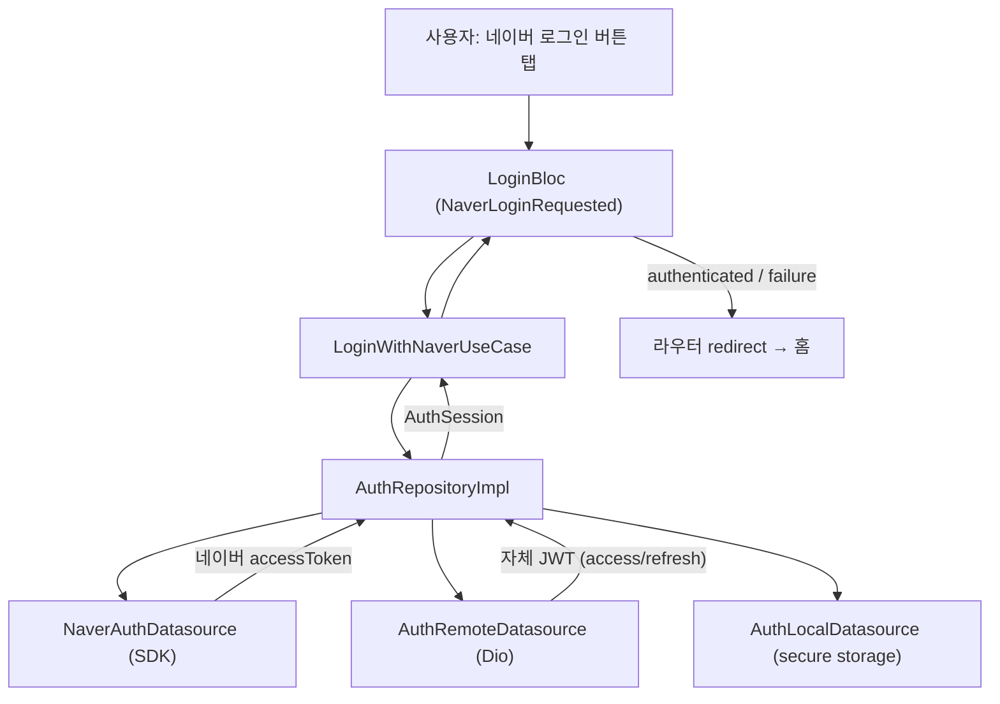

# TDD — 네이버 로그인 기술 설계 문서

---

## 메타 정보

| 항목 | 내용 |
|------|------|
| 기능 ID | `feature/auth-naver-login` |
| 작성자 | ahndohyeon |
| 작성일 | 2026-07-03 |
| 상태 | Draft |
| 관련 PRD | `prd.md` |

---

## 1. 기능 요약

네이버 계정 기반 소셜 로그인을 제공한다. `flutter_naver_login` SDK로 네이버 인증을 수행해 네이버 액세스 토큰을 획득하고, 이를 자체 백엔드에 전달하여 자체 JWT(access/refresh)를 발급받는다. 발급받은 토큰은 secure storage에 저장하며, 앱 재실행 시 저장된 토큰으로 세션을 복원(자동 로그인)한다. 이후 카카오·애플 등으로 확장 가능하도록 소셜 provider를 추상화한다.

**피처 경로**: `lib/features/auth/`

---

## 2. 전체 데이터 흐름

```
[사용자: 네이버 로그인 버튼 탭]
    ↓
[LoginPage / NaverLoginButton]  →  LoginBloc.add(NaverLoginRequested())
    ↓
[LoginBloc]   →  LoginWithNaverUseCase() 호출, 상태 loading emit
    ↓
[LoginWithNaverUseCase]  →  AuthRepository.loginWithNaver()
    ↓
[AuthRepositoryImpl]
    ├─ NaverAuthDatasource.login()        → 네이버 SDK 인증, 네이버 accessToken 획득
    ├─ AuthRemoteDatasource.socialLogin() → 백엔드에 네이버 토큰 전달, 자체 JWT 수신
    └─ AuthLocalDatasource.saveTokens()   → secure storage에 access/refresh 저장
    ↓
[AuthSession(User + AuthTokens)] 반환
    ↓
[LoginBloc]   →  authenticated(user) 상태 emit (실패 시 catch → failure emit)
    ↓
[LoginPage / 라우터 redirect]  →  홈 화면 이동
```



---

## 3. Domain 레이어

> 순수 Dart 코드만 사용한다. Flutter, Dio, flutter_naver_login, secure storage 등 외부 라이브러리에 의존하지 않는다.

### 3.1 Entities

| 파일 경로 | 클래스명 | 설명 |
|-----------|---------|------|
| `domain/entities/user.dart` | `User` | 인증된 사용자 정보 |
| `domain/entities/auth_tokens.dart` | `AuthTokens` | 자체 JWT access/refresh 토큰 |
| `domain/entities/auth_session.dart` | `AuthSession` | 로그인 결과 (User + AuthTokens) |
| `domain/entities/social_provider.dart` | `SocialProvider` | 소셜 로그인 제공자 enum (확장 지점) |

**Entity 필드 목록**

```dart
// social_provider.dart
enum SocialProvider { naver } // 확장: kakao, apple

// user.dart
class User {
  final String id;
  final String nickname;
  final String? email;
  final String? profileImageUrl;
  final SocialProvider provider;

  const User({
    required this.id,
    required this.nickname,
    required this.provider,
    this.email,
    this.profileImageUrl,
  });
}

// auth_tokens.dart
class AuthTokens {
  final String accessToken;
  final String refreshToken;
  final DateTime expiresAt;

  const AuthTokens({
    required this.accessToken,
    required this.refreshToken,
    required this.expiresAt,
  });

  bool get isExpired => DateTime.now().isAfter(expiresAt);
}

// auth_session.dart
class AuthSession {
  final User user;
  final AuthTokens tokens;

  const AuthSession({required this.user, required this.tokens});
}
```

### 3.2 Repository 인터페이스

> 프로젝트는 `dartz`/`fpdart` 를 사용하지 않는다. 실패는 예외(throw)로 전달하고, 반환 타입은 순수 Entity 를 사용한다 (7. 에러 처리 전략 참조).

| 파일 경로 | 인터페이스명 | 메서드 |
|-----------|------------|--------|
| `domain/repositories/auth_repository.dart` | `AuthRepository` | `loginWithNaver`, `logout`, `withdraw`, `restoreSession`, `refreshTokens` |

```dart
abstract class AuthRepository {
  /// 네이버 인증 → 백엔드 JWT 발급 → 토큰 저장 후 세션 반환.
  Future<AuthSession> loginWithNaver();

  /// 앱 로그아웃: 로컬 토큰만 삭제한다. (네이버 연동 유지)
  Future<void> logout();

  /// 회원 탈퇴: 로컬 세션/토큰 정리.
  /// 네이버 연동 revoke는 서버에서 처리한다 (Phase 7 withdraw API).
  /// 백엔드 연동 시 withdraw API 호출을 포함한다.
  Future<void> withdraw();

  /// 저장된 토큰으로 세션 복원. 유효 세션이 없으면 null.
  Future<AuthSession?> restoreSession();

  /// refresh 토큰으로 access/refresh 재발급.
  Future<AuthTokens> refreshTokens();
}
```

### 3.3 Use Cases

| 파일 경로 | 클래스명 | 입력 | 출력 |
|-----------|---------|------|------|
| `domain/usecases/login_with_naver_usecase.dart` | `LoginWithNaverUseCase` | 없음 | `Future<AuthSession>` |
| `domain/usecases/logout_usecase.dart` | `LogoutUseCase` | 없음 | `Future<void>` |
| `domain/usecases/withdraw_usecase.dart` | `WithdrawUseCase` | 없음 | `Future<void>` |
| `domain/usecases/restore_session_usecase.dart` | `RestoreSessionUseCase` | 없음 | `Future<AuthSession?>` |

> `refreshTokens` 는 토큰 갱신 인터셉터/리프레시 흐름에서 Repository 를 직접 사용하므로 별도 UseCase 로 노출하지 않는다(설계 결정 참조).

---

## 4. Data 레이어

> Model/DTO 타입은 domain 또는 presentation 으로 노출하지 않는다. Repository 구현체에서 Entity 로 변환한다.

### 4.1 Models (DTO)

| 파일 경로 | 클래스명 | 대응 Entity | 직렬화 방식 |
|-----------|---------|------------|-----------|
| `data/models/user_model.dart` | `UserModel` | `User` | `@freezed` + `@JsonSerializable` |
| `data/models/auth_token_model.dart` | `AuthTokenModel` | `AuthTokens` | `@freezed` + `@JsonSerializable` |
| `data/models/social_login_request.dart` | `SocialLoginRequest` | (요청 전용) | `@freezed` + `@JsonSerializable` |
| `data/models/auth_response_model.dart` | `AuthResponseModel` | `AuthSession` | `@freezed` + `@JsonSerializable` |

**Model → Entity 변환 메서드**

```dart
// data/models/user_model.dart
extension UserModelX on UserModel {
  User toEntity() => User(
    id: id,
    nickname: nickname,
    email: email,
    profileImageUrl: profileImageUrl,
    provider: SocialProvider.naver,
  );
}

// data/models/auth_token_model.dart
extension AuthTokenModelX on AuthTokenModel {
  AuthTokens toEntity() => AuthTokens(
    accessToken: accessToken,
    refreshToken: refreshToken,
    expiresAt: DateTime.now().add(Duration(seconds: expiresIn)),
  );
}

// data/models/auth_response_model.dart
extension AuthResponseModelX on AuthResponseModel {
  AuthSession toEntity() => AuthSession(
    user: user.toEntity(),
    tokens: token.toEntity(),
  );
}
```

### 4.2 Data Sources

| 파일 경로 | 클래스명 | 종류 | 설명 |
|-----------|---------|------|------|
| `data/datasources/naver_auth_datasource.dart` | `NaverAuthDatasource` | External(SDK) | `flutter_naver_login` 래퍼. 네이버 로그인·세션 해제(`logout`). 연동 revoke(`logoutAndDeleteToken`)는 사용하지 않음 |
| `data/datasources/auth_remote_datasource.dart` | `AuthRemoteDatasource` | Remote(Dio) | 백엔드 소셜 로그인/토큰 갱신/로그아웃/탈퇴 API 호출 |
| `data/datasources/auth_local_datasource.dart` | `AuthLocalDatasource` | Local(SecureStorage) | access/refresh 토큰 저장·조회·삭제 |

```dart
abstract class NaverAuthDatasource {
  Future<NaverAccountModel> login();  // 취소 시 AuthException throw
  Future<void> logout();  // SDK 세션 해제. FR-05 로그아웃 시 Repository에서 호출
}

abstract class AuthRemoteDatasource {
  Future<AuthResponseModel> socialLogin(SocialLoginRequest request);
  Future<AuthTokenModel> refresh(String refreshToken);
  Future<void> logout();
  Future<void> withdraw();
}

abstract class AuthLocalDatasource {
  Future<void> saveTokens(AuthTokenModel token);
  Future<AuthTokenModel?> readTokens();
  Future<void> clear();
}
```

### 4.3 Repository 구현체

| 파일 경로 | 클래스명 | 구현 인터페이스 |
|-----------|---------|--------------|
| `data/repositories/auth_repository_impl.dart` | `AuthRepositoryImpl` | `AuthRepository` |

```dart
class AuthRepositoryImpl implements AuthRepository {
  AuthRepositoryImpl({
    required NaverAuthDatasource naverDatasource,
    required AuthRemoteDatasource remoteDatasource,
    required AuthLocalDatasource localDatasource,
  });

  @override
  Future<AuthSession> loginWithNaver() async {
    final naverToken = await _naverDatasource.login();
    final response = await _remoteDatasource.socialLogin(
      SocialLoginRequest(provider: 'naver', accessToken: naverToken),
    );
    await _localDatasource.saveTokens(response.token);
    return response.toEntity();
  }
  // logout / restoreSession / refreshTokens 구현 ...
}
```

---

## 5. Presentation 레이어

### 5.1 상태 관리 방식

| 구분 | 선택 | 이유 |
|------|------|------|
| 방식 | `Bloc` | 로그인 제출·취소·실패·세션 복원·로그아웃 등 여러 이벤트와 비동기 상태 전이가 존재. `overview.md`의 "로그인 제출, 유효성 실패, 토큰 갱신, 로그아웃"은 Bloc 권장 케이스 |
| 폴더 | `presentation/bloc/` | |

### 5.2 Cubit / Bloc

| 파일 경로 | 클래스명 | 상태 클래스 | 이벤트 클래스 (Bloc만) |
|-----------|---------|-----------|---------------------|
| `presentation/bloc/login_bloc.dart` | `LoginBloc` | `LoginState` | `LoginEvent` |
| `presentation/bloc/login_state.dart` | — | `LoginState` | — |
| `presentation/bloc/login_event.dart` | — | — | `LoginEvent` |

**Event 정의**

```dart
// login_event.dart (@freezed)
@freezed
class LoginEvent with _$LoginEvent {
  const factory LoginEvent.naverLoginRequested() = _NaverLoginRequested;
  const factory LoginEvent.withdrawRequested() = _WithdrawRequested;
  const factory LoginEvent.sessionRestoreRequested() = _SessionRestoreRequested;
  const factory LoginEvent.logoutRequested() = _LogoutRequested;
}
```

**State 정의**

```dart
// login_state.dart (@freezed)
@freezed
class LoginState with _$LoginState {
  const factory LoginState.initial() = _Initial;
  const factory LoginState.loading() = _Loading;
  const factory LoginState.authenticated(User user) = _Authenticated;
  const factory LoginState.unauthenticated() = _Unauthenticated;
  const factory LoginState.failure(String message) = _Failure;
}
```

### 5.3 Pages & Widgets

| 파일 경로 | 클래스명 | 역할 |
|-----------|---------|------|
| `presentation/pages/login_page.dart` | `LoginPage` | 로그인 진입 화면(기존 파일 수정). `LoginBloc` 연결, 상태별 UI 표시 |
| `presentation/widgets/naver_login_button.dart` | `NaverLoginButton` | 네이버 브랜드 로그인 버튼. 탭 시 `NaverLoginRequested` 발생 |

### 5.4 라우팅

| 경로 (path) | 페이지 클래스 | 파라미터 |
|-------------|------------|---------|
| `/login` | `LoginPage` | 없음 (기존 등록됨) |

`lib/router/app_router.dart` 는 이미 `/login` 을 등록하고 있다. 인증 상태에 따라 홈/로그인으로 분기하도록 `redirect` 를 추가한다.

```dart
final GoRouter appRouter = GoRouter(
  initialLocation: LoginPage.routePath,
  // 인증 상태에 따른 가드는 refreshListenable + redirect 로 구성
  routes: [
    GoRoute(
      name: LoginPage.routeName,
      path: LoginPage.routePath,
      builder: (context, state) => const LoginPage(),
    ),
    // TODO: 홈 라우트 등록 후 로그인 성공 시 redirect
  ],
);
```

---

## 6. API 명세

| 메서드 | 엔드포인트 | 설명 | 인증 필요 |
|--------|-----------|------|---------|
| `POST` | `/api/v1/auth/social/login` | 네이버 accessToken 전달 → 자체 JWT 발급 | N |
| `POST` | `/api/v1/auth/token/refresh` | refresh 토큰으로 access/refresh 재발급 (전역 인터셉터에서 사용) | N |
| `POST` | `/api/v1/auth/logout` | 서버 세션/토큰 무효화 | Y |
| `POST` | `/api/v1/auth/withdraw` | 회원 탈퇴 + **서버에서 네이버 연동 revoke** | Y |

> 실제 엔드포인트 경로·필드명은 백엔드 스펙 확정 시 갱신한다.

**Request Body 예시** (`POST /api/v1/auth/social/login`)

```json
{
  "provider": "naver",
  "accessToken": "naver-sdk-access-token"
}
```

**Response Body 예시**

```json
{
  "user": {
    "id": "12345",
    "nickname": "홍길동",
    "email": "user@example.com",
    "profileImageUrl": "https://.../profile.png"
  },
  "token": {
    "accessToken": "app-jwt-access-token",
    "refreshToken": "app-jwt-refresh-token",
    "expiresIn": 3600
  }
}
```

---

## 7. 에러 처리 전략

> 이 프로젝트는 `Either<Failure, T>` 를 사용하지 않는다. DataSource/Repository 에서 예외를 throw 하고, `LoginBloc` 에서 `try/catch` 로 잡아 `failure` State 로 전환한다. 공통 예외 타입은 `core/exception/` 에 신설한다.

| 에러 종류 | 발생 위치 | 처리 방법 |
|----------|----------|---------|
| 네트워크 오류 | `AuthRemoteDatasource` | `NetworkException` throw → Bloc에서 "네트워크 오류" failure |
| 서버 에러 (4xx/5xx) | `AuthRemoteDatasource` | `ServerException(statusCode)` throw |
| 네이버 인증 취소 | `NaverAuthDatasource` | `AuthException.cancelled` throw → 로그인 화면 유지 |
| 네이버 토큰 실패/무효 | `NaverAuthDatasource` | `AuthException.socialFailed` throw |
| 토큰 갱신 실패 | `Dio 인증 인터셉터` | `AuthException.unauthenticated` 전파 → 로그아웃 처리 후 로그인 화면 |
| 탈퇴 처리 실패 | `AuthRepositoryImpl` | `ServerException/AuthException` throw → 탈퇴 화면 유지 + 재시도 |

**신설 예외 계층 (`core/exception/`)**

```dart
// core/exception/app_exception.dart
sealed class AppException implements Exception {
  const AppException(this.message);
  final String message;
}

class NetworkException extends AppException { const NetworkException([super.m = '네트워크 오류']); }
class ServerException extends AppException {
  const ServerException(this.statusCode, [super.m = '서버 오류']);
  final int statusCode;
}
class AuthException extends AppException {
  const AuthException(super.message, this.type);
  final AuthErrorType type; // cancelled, socialFailed, unauthenticated
}
```

---

## 8. 로컬 상태 & 캐싱 전략

| 항목 | 전략 | 저장소 |
|------|------|--------|
| access/refresh 토큰 | 로그인 성공 시 저장, 앱 시작 시 읽어 자동 로그인, **로그아웃 시 로컬 토큰 삭제 + 네이버 SDK 세션 해제** | `flutter_secure_storage` |
| 탈퇴 직후 세션 | 로컬 토큰/세션 데이터를 즉시 삭제하고 미인증 상태로 강제 전환 | `flutter_secure_storage` |
| 사용자 프로필(User) | 인메모리(Bloc State) 보관, 영속 캐시는 하지 않음(필요 시 추후 추가) | 없음 |

> 토큰 저장/조회는 `core/service/secure_storage_service.dart`(`SecureStorageService`) 로 래핑하고, `AuthLocalDatasource` 가 이를 사용한다.

---

## 9. 의존성 주입

> 프로젝트는 `get_it` 대신 `provider` 기반 DI 를 사용한다([lib/core/network/network_providers.dart](../../../lib/core/network/network_providers.dart) 참조). auth 피처 전용 provider 묶음을 만들어 `SsossAppScope` 의 `MultiProvider` 에 추가한다.

```dart
// lib/features/auth/presentation/auth_providers.dart
class AuthProviders {
  AuthProviders._();

  static List<SingleChildWidget> build() => [
    Provider<NaverAuthDatasource>(create: (_) => NaverAuthDatasourceImpl()),
    ProxyProvider<Dio, AuthRemoteDatasource>(
      update: (_, dio, __) => AuthRemoteDatasourceImpl(dio),
    ),
    Provider<AuthLocalDatasource>(
      create: (_) => AuthLocalDatasourceImpl(SecureStorageService()),
    ),
    ProxyProvider3<NaverAuthDatasource, AuthRemoteDatasource,
        AuthLocalDatasource, AuthRepository>(
      update: (_, naver, remote, local, __) => AuthRepositoryImpl(
        naverDatasource: naver,
        remoteDatasource: remote,
        localDatasource: local,
      ),
    ),
  ];
}
```

`LoginBloc` 은 화면 진입 시 `BlocProvider` 로 생성하고 `context.read<AuthRepository>()` 로 주입한 UseCase 를 전달한다.

---

## 10. 테스트 계획

| 대상 | 테스트 종류 | 주요 시나리오 |
|------|-----------|------------|
| `LoginWithNaverUseCase` | Unit Test | 정상 로그인, 네이버 취소 예외 전파, 백엔드 실패 예외 전파 |
| `AuthRepositoryImpl` | Unit Test | Mock 3개 DataSource 조합 검증, 토큰 저장 호출 확인, 예외 매핑 |
| `LoginBloc` | Unit Test (bloc_test) | NaverLoginRequested → loading → authenticated / failure, SessionRestore, Logout 상태 전이 |
| `LoginPage` | Widget Test | 네이버 버튼 렌더링, 탭 시 이벤트 발생, loading/failure UI 표시 |
| `WithdrawUseCase` | Unit Test | 정상 탈퇴, 원격 실패 예외 전파 |
| `AuthRepositoryImpl.withdraw()` | Unit Test | local clear만 수행, (Phase 7) remote withdraw 선호출 검증 |
| `Dio Auth Interceptor` | Unit/Integration Test | 임의 API 401 응답 시 refresh 후 원요청 자동 재시도, refresh 실패 시 로그아웃 |

---

## 11. 설계 결정

> AGENTS.md 지침에 따라 기능 범위의 설계 결정을 기록한다. (프로젝트 전역 결정은 `docs/adr/` 에서 다룸)

| 결정 | 선택 | 근거 |
|------|------|------|
| 상태 관리 | Cubit 대신 **Bloc** | 로그인/취소/실패/세션복원/로그아웃 등 다중 이벤트·비동기 전이 |
| 에러 처리 | Either 대신 **예외 throw + try/catch** | 프로젝트에 `dartz`/`fpdart` 미도입, 추가 의존성 없이 처리 |
| 의존성 주입 | get_it 대신 **provider 패턴 유지** | 기존 `NetworkProviders` 와 일관성 |
| 토큰 저장 | **`flutter_secure_storage`** | 토큰은 민감 정보, 안전 저장 필요 (신규 의존성 추가) |
| 소셜 provider | `SocialProvider` **enum + provider 파라미터 추상화** | 카카오·애플 확장 대비 (PRD FR-08) |
| 네이버 SDK 위치 | `data/datasources/naver_auth_datasource.dart` | 외부 데이터 소스로 취급, Repository 에서 조합 |
| 탈퇴 처리 순서 | **remote withdraw(가능 시) → local clear** | 서버에서 네이버 연동 revoke. 클라이언트 `logoutAndDeleteToken` 미사용 |
| 토큰 갱신 위치 | **Dio 전역 인증 인터셉터** | 어떤 API 호출이든 만료 토큰을 공통 처리하기 위함 |

---

## 12. 신규 의존성 & 선행 작업

- **추가 패키지**: `flutter_secure_storage` (pubspec 추가 필요)
- **기존 패키지**: `flutter_naver_login`, `flutter_bloc`, `dio`, `freezed`, `json_serializable` (이미 존재)
- **네이티브 설정**: 네이버 개발자센터 앱 등록, Android `AndroidManifest`/iOS `Info.plist` 에 네이버 로그인 URL scheme·클라이언트 정보 설정
- **env**: API Base URL 을 `env/.env.*` 에 추가하고 `EnvLoader` 키로 관리
- **코드 생성**: `@freezed`·`@JsonSerializable` 작성 후 `./script/build_runner.sh` 실행
