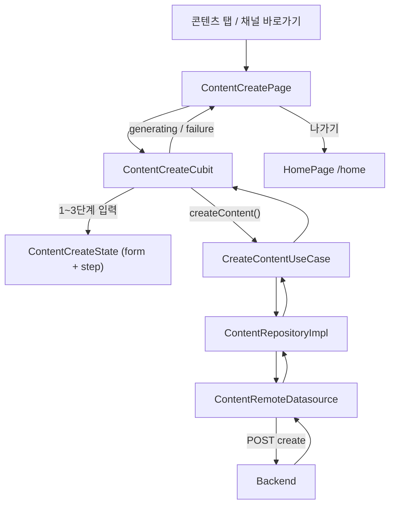

# TDD — AI 콘텐츠 생성 기술 설계 문서

---

## 메타 정보

| 항목 | 내용 |
|------|------|
| 기능 ID | `feature/content-create` |
| 작성자 | ahndohyeon |
| 작성일 | 2026-07-15 |
| 상태 | Draft |
| 관련 PRD | [`prd.md`](./prd.md) |

---

## 1. 기능 요약

사용자가 3단계(기본 설정 → 콘텐츠 설정 → 세부 설정)로 업로드 채널·목적·작성 톤·강조/금지 내용·키워드·사진 가이드를 입력한 뒤, 서버에 콘텐츠 생성을 요청한다. 선택 항목은 domain enum으로 두고 API payload는 mapper로 변환한다. 생성 요청 중에는 전용 로딩 UI를 보여주고, `나가기`로 홈에 복귀한다.

기존 `lib/features/content/` 피처를 확장한다. (콘텐츠 탭·채널 바로가기는 이미 존재)

**피처 경로**: `lib/features/content/`

---

## 2. 전체 데이터 흐름

```
[콘텐츠 탭 / 채널 바로가기 탭]
    ↓
[ContentCreatePage]  →  ContentCreateCubit 메서드 호출
    ├─ 1~3단계: 선택·입력·키워드 추가/삭제 (로컬 State만 갱신)
    └─ 콘텐츠 생성하기 탭
         ↓
[ContentCreateCubit.createContent()]
    ↓
[CreateContentUseCase]  →  ContentRepository.createContent(input)
    ↓
[ContentRepositoryImpl]  →  ContentRemoteDatasource.createContent(request)
    ↓
[ContentRemoteDatasource]  →  POST /api/v1/contents (Dio)
    ↓
[CreateContentResultModel] → toEntity() → CreateContentResult
    ↓
[ContentCreateCubit]  →  generating / failure 상태 emit
    ↓
[ContentCreatePage]
    ├─ generating → 생성 중 UI (나가기 → /home)
    └─ failure → 스낵바 + 3단계 복귀 또는 재시도
```



---

## 3. Domain 레이어

> 순수 Dart 코드만 사용한다. Flutter, Dio, freezed(런타임 코드 생성 결과 제외) 등 외부 라이브러리에 의존하지 않는다.

### 3.1 Entities / Enums

| 파일 경로 | 클래스명 | 설명 |
|-----------|---------|------|
| `domain/entities/upload_channel.dart` | `UploadChannel` | 업로드 SNS 채널 enum |
| `domain/entities/upload_purpose.dart` | `UploadPurpose` | 업로드 목적 enum |
| `domain/entities/content_tone.dart` | `ContentTone` | 콘텐츠 작성 톤 enum |
| `domain/entities/content_create_input.dart` | `ContentCreateInput` | 생성 요청에 필요한 입력 값 집합 |
| `domain/entities/create_content_result.dart` | `CreateContentResult` | 생성 API 성공 결과 (최소 id 등) |

**Entity / Enum 정의**

```dart
// upload_channel.dart
enum UploadChannel {
  blog,
  thread,
  carrot,
  instagram,
}

// upload_purpose.dart
enum UploadPurpose {
  informative,   // 정보성
  eventDiscount, // 이벤트/할인
  newMenuPromo,  // 신메뉴/홍보
}

// content_tone.dart
enum ContentTone {
  daily,         // 일상형
  emotional,     // 감성형
  informational, // 정보형
  promotional,   // 홍보형
}

// content_create_input.dart
class ContentCreateInput {
  final UploadChannel channel;
  final UploadPurpose purpose;
  final ContentTone tone;
  final String highlight;       // 강조 내용 (필수)
  final String? forbidden;      // 금지 내용 (선택)
  final List<String> keywords;  // # 없이 저장. UI에서만 # 표시
  final bool photoGuideEnabled;

  const ContentCreateInput({
    required this.channel,
    required this.purpose,
    required this.tone,
    required this.highlight,
    this.forbidden,
    this.keywords = const [],
    this.photoGuideEnabled = false,
  });
}

// create_content_result.dart
class CreateContentResult {
  final String contentId;

  const CreateContentResult({required this.contentId});
}
```

> 기존 `presentation/widgets/content_channel_shortcuts.dart` 의 `ContentChannel` 은 domain `UploadChannel` 으로 이전·통합한다. presentation 은 domain enum 을 import 한다.

### 3.2 Repository 인터페이스

> 프로젝트는 `Either<Failure, T>` 를 사용하지 않는다. 실패는 예외 throw, 반환은 Entity.

| 파일 경로 | 인터페이스명 | 메서드 |
|-----------|------------|--------|
| `domain/repositories/content_repository.dart` | `ContentRepository` | `createContent` |

```dart
abstract class ContentRepository {
  /// 수집된 입력으로 AI 콘텐츠 생성을 요청한다.
  Future<CreateContentResult> createContent(ContentCreateInput input);
}
```

### 3.3 Use Cases

| 파일 경로 | 클래스명 | 입력 | 출력 |
|-----------|---------|------|------|
| `domain/usecases/create_content_usecase.dart` | `CreateContentUseCase` | `ContentCreateInput` | `Future<CreateContentResult>` |

```dart
class CreateContentUseCase {
  CreateContentUseCase(this._repository);

  final ContentRepository _repository;

  Future<CreateContentResult> call(ContentCreateInput input) {
    final trimmed = input.highlight.trim();
    if (trimmed.isEmpty) {
      throw const ValidationException('강조 내용을 입력해 주세요.');
    }
    return _repository.createContent(
      ContentCreateInput(
        channel: input.channel,
        purpose: input.purpose,
        tone: input.tone,
        highlight: trimmed,
        forbidden: input.forbidden?.trim().isEmpty == true
            ? null
            : input.forbidden?.trim(),
        keywords: input.keywords,
        photoGuideEnabled: input.photoGuideEnabled,
      ),
    );
  }
}
```

> `ValidationException` 이 `core/exception/` 에 없으면 본 기능에서 추가한다. (설계 결정 참조)

---

## 4. Data 레이어

> Model/DTO 타입은 domain·presentation 으로 노출하지 않는다. Repository 구현체에서 Entity 로 변환한다.

### 4.1 Models (DTO) & Mapper

| 파일 경로 | 클래스명 | 대응 Entity | 직렬화 방식 |
|-----------|---------|------------|-----------|
| `data/models/create_content_request.dart` | `CreateContentRequest` | `ContentCreateInput` | `@freezed` + `@JsonSerializable` |
| `data/models/create_content_result_model.dart` | `CreateContentResultModel` | `CreateContentResult` | `@freezed` + `@JsonSerializable` |
| `data/mappers/content_create_api_mapper.dart` | `ContentCreateApiMapper` | enum → API string | 순수 함수/클래스 |

**Enum → API 값 매퍼**

```dart
// data/mappers/content_create_api_mapper.dart
class ContentCreateApiMapper {
  const ContentCreateApiMapper._();

  static String channel(UploadChannel value) => switch (value) {
        UploadChannel.blog => 'BLOG',
        UploadChannel.thread => 'THREAD',
        UploadChannel.carrot => 'CARROT',
        UploadChannel.instagram => 'INSTAGRAM',
      };

  static String purpose(UploadPurpose value) => switch (value) {
        UploadPurpose.informative => 'INFORMATIVE',
        UploadPurpose.eventDiscount => 'EVENT_DISCOUNT',
        UploadPurpose.newMenuPromo => 'NEW_MENU_PROMO',
      };

  static String tone(ContentTone value) => switch (value) {
        ContentTone.daily => 'DAILY',
        ContentTone.emotional => 'EMOTIONAL',
        ContentTone.informational => 'INFORMATIONAL',
        ContentTone.promotional => 'PROMOTIONAL',
      };
}
```

> 서버 스펙 확정 시 문자열만 수정한다. domain enum·UI 라벨은 유지한다.

**Request / Response**

```dart
@freezed
class CreateContentRequest with _$CreateContentRequest {
  const factory CreateContentRequest({
    required String channel,
    required String purpose,
    required String tone,
    required String highlight,
    String? forbidden,
    required List<String> keywords,
    required bool photoGuideEnabled,
  }) = _CreateContentRequest;

  factory CreateContentRequest.fromEntity(ContentCreateInput input) =>
      CreateContentRequest(
        channel: ContentCreateApiMapper.channel(input.channel),
        purpose: ContentCreateApiMapper.purpose(input.purpose),
        tone: ContentCreateApiMapper.tone(input.tone),
        highlight: input.highlight,
        forbidden: input.forbidden,
        keywords: input.keywords,
        photoGuideEnabled: input.photoGuideEnabled,
      );

  factory CreateContentRequest.fromJson(Map<String, dynamic> json) =>
      _$CreateContentRequestFromJson(json);
}

@freezed
class CreateContentResultModel with _$CreateContentResultModel {
  const factory CreateContentResultModel({
    required String contentId,
  }) = _CreateContentResultModel;

  factory CreateContentResultModel.fromJson(Map<String, dynamic> json) =>
      _$CreateContentResultModelFromJson(json);
}

extension CreateContentResultModelX on CreateContentResultModel {
  CreateContentResult toEntity() => CreateContentResult(contentId: contentId);
}
```

### 4.2 Data Sources

| 파일 경로 | 클래스명 | 종류 | 설명 |
|-----------|---------|------|------|
| `data/datasources/content_remote_datasource.dart` | `ContentRemoteDatasource` | Remote(Dio) | 콘텐츠 생성 API |
| `data/datasources/content_remote_datasource_impl.dart` | `ContentRemoteDatasourceImpl` | Remote | Dio 구현. `CancelToken` 지원 |

```dart
abstract class ContentRemoteDatasource {
  Future<CreateContentResultModel> createContent(
    CreateContentRequest request, {
    CancelToken? cancelToken,
  });
}
```

> 기존 스텁 `content_datasource.dart` 는 remote 구현으로 정리·대체한다.

### 4.3 Repository 구현체

| 파일 경로 | 클래스명 | 구현 인터페이스 |
|-----------|---------|--------------|
| `data/repositories/content_repository_impl.dart` | `ContentRepositoryImpl` | `ContentRepository` |

```dart
class ContentRepositoryImpl implements ContentRepository {
  ContentRepositoryImpl({
    required ContentRemoteDatasource remoteDatasource,
  }) : _remote = remoteDatasource;

  final ContentRemoteDatasource _remote;
  CancelToken? _activeCancelToken;

  @override
  Future<CreateContentResult> createContent(ContentCreateInput input) async {
    _activeCancelToken?.cancel();
    _activeCancelToken = CancelToken();
    try {
      final model = await _remote.createContent(
        CreateContentRequest.fromEntity(input),
        cancelToken: _activeCancelToken,
      );
      return model.toEntity();
    } on DioException catch (e) {
      if (CancelToken.isCancel(e)) {
        throw const CancelledException();
      }
      // NetworkException / ServerException 매핑 (기존 auth 패턴)
      rethrow;
    } finally {
      _activeCancelToken = null;
    }
  }

  /// 생성 중 나가기 시 Cubit 에서 호출한다.
  void cancelInFlightRequest() {
    _activeCancelToken?.cancel('user_exit');
    _activeCancelToken = null;
  }
}
```

> `cancelInFlightRequest` 는 Repository 인터페이스에 둘지 Impl 전용으로 둘지: **Impl 전용 + Cubit 이 Impl 을 직접 알지 않도록** UseCase/Repository 에 `cancelCreate()` 를 추가한다.

```dart
// ContentRepository 확장
abstract class ContentRepository {
  Future<CreateContentResult> createContent(ContentCreateInput input);
  void cancelCreate();
}
```

---

## 5. Presentation 레이어

### 5.1 상태 관리 방식

| 구분 | 선택 | 이유 |
|------|------|------|
| 방식 | `Cubit` | 대부분 폼 필드·스텝 갱신(`copyWith`). 생성 요청은 loading → success/failure 단일 비동기 흐름. 이벤트 클래스를 늘릴 이점이 적음 |
| 폴더 | `presentation/cubit/` | |

> 생성 실패 재시도·취소가 복잡해지면 이후 Bloc 분리를 검토한다.

### 5.2 Cubit

| 파일 경로 | 클래스명 | 상태 클래스 |
|-----------|---------|-----------|
| `presentation/cubit/content_create_cubit.dart` | `ContentCreateCubit` | `ContentCreateState` |
| `presentation/cubit/content_create_state.dart` | — | `ContentCreateState` |

**State 정의**

```dart
enum ContentCreateStep { basic, content, detail }

enum ContentCreatePhase {
  editing,    // 1~3단계 입력
  generating, // 생성 중 화면
  failure,    // 생성 실패 (editing 복귀 + 메시지)
}

@freezed
class ContentCreateState with _$ContentCreateState {
  const ContentCreateState._();

  const factory ContentCreateState({
    @Default(ContentCreateStep.basic) ContentCreateStep step,
    @Default(ContentCreatePhase.editing) ContentCreatePhase phase,
    UploadChannel? channel,
    UploadPurpose? purpose,
    ContentTone? tone,
    @Default('') String highlight,
    @Default('') String forbidden,
    @Default(<String>[]) List<String> keywords,
    @Default(false) bool photoGuideEnabled,
    String? errorMessage,
    String? createdContentId, // 성공 시. 결과 UI는 Out of Scope
  }) = _ContentCreateState;

  bool get canGoNextFromBasic => channel != null;

  bool get canGoNextFromContent => purpose != null && tone != null;

  bool get canSubmit => highlight.trim().isNotEmpty;
}
```

**Cubit 메서드**

| 메서드 | 동작 |
|--------|------|
| `selectChannel` | channel 설정 |
| `selectPurpose` | purpose 설정 |
| `selectTone` | tone 설정 |
| `goNext` | 단계 검증 후 next step |
| `goBack` | 이전 step. basic 에서 pop |
| `setHighlight` / `setForbidden` | 텍스트 갱신 |
| `addKeyword(String raw)` | trim, 공백 거부, `#` 제거 후 저장. 중복 무시 |
| `removeKeyword(String keyword)` | 목록에서 제거 |
| `togglePhotoGuide` | bool 토글 |
| `createContent` | phase=generating 후 UseCase 호출. 성공 시 id 보관(결과 화면은 후속). 실패 시 phase=editing + errorMessage |
| `exitToHome` | `cancelCreate()` 후 라우터에서 `/home` 이동은 Page/Listener 가 처리. Cubit 은 cancel 만 |

```dart
class ContentCreateCubit extends Cubit<ContentCreateState> {
  ContentCreateCubit({
    required CreateContentUseCase createContentUseCase,
    required ContentRepository contentRepository,
    UploadChannel? initialChannel,
  })  : _createContent = createContentUseCase,
        _repository = contentRepository,
        super(ContentCreateState(channel: initialChannel));

  final CreateContentUseCase _createContent;
  final ContentRepository _repository;

  Future<void> createContent() async {
    final s = state;
    if (!s.canSubmit ||
        s.channel == null ||
        s.purpose == null ||
        s.tone == null) {
      return;
    }
    emit(s.copyWith(phase: ContentCreatePhase.generating, errorMessage: null));
    try {
      final result = await _createContent(
        ContentCreateInput(
          channel: s.channel!,
          purpose: s.purpose!,
          tone: s.tone!,
          highlight: s.highlight,
          forbidden: s.forbidden,
          keywords: s.keywords,
          photoGuideEnabled: s.photoGuideEnabled,
        ),
      );
      emit(state.copyWith(createdContentId: result.contentId));
      // 결과 화면 전환: Out of Scope. 당분간 generating 유지 또는 TODO 네비게이션
    } on CancelledException {
      // 나가기로 취소된 경우 — 상태 emit 불필요(이미 화면 이탈)
    } on AppException catch (e) {
      emit(state.copyWith(
        phase: ContentCreatePhase.editing,
        step: ContentCreateStep.detail,
        errorMessage: e.message,
      ));
    }
  }

  void exitGenerating() {
    _repository.cancelCreate();
  }
}
```

### 5.3 Pages & Widgets

| 파일 경로 | 클래스명 | 역할 |
|-----------|---------|------|
| `presentation/pages/content_create_page.dart` | `ContentCreatePage` | 단일 라우트. step/phase 에 따라 본문 전환 |
| `presentation/widgets/content_create_progress_bar.dart` | `ContentCreateProgressBar` | 01/02/03 진행 바 |
| `presentation/widgets/content_create_step_basic.dart` | `ContentCreateStepBasic` | 업로드 채널 선택 |
| `presentation/widgets/content_create_step_content.dart` | `ContentCreateStepContent` | 목적·톤 선택 |
| `presentation/widgets/content_create_step_detail.dart` | `ContentCreateStepDetail` | 강조/금지/키워드/사진 가이드 |
| `presentation/widgets/content_keyword_chip.dart` | `ContentKeywordChip` | `#키워드` + X |
| `presentation/widgets/content_generating_view.dart` | `ContentGeneratingView` | 생성 중 UI (플레이스홀더·카피·나가기용 앱바는 Page) |

**페이지 구성 규칙**

- `phase == editing` + `step`: 앱바 back + 타이틀 `콘텐츠 생성` + progress bar + step body + 하단 CTA
- `phase == generating`: 앱바 **back·타이틀 없음** + 우측 `나가기` + `ContentGeneratingView`. **하단 CTA 없음**
  - `나가기` / 시스템 back → `cancelCreate()` 후 `/home`
- 로딩 이미지: 고정 크기 `Container` 플레이스홀더 (GIF 교체 지점 주석)
- Android 시스템 back (`PopScope`): generating 중에는 `exitGenerating` + `/home` 과 동일. editing 중에는 `goBack` 또는 pop

### 5.4 라우팅

| 경로 (path) | 페이지 클래스 | 파라미터 |
|-------------|------------|---------|
| `/content/create` | `ContentCreatePage` | `extra`: `UploadChannel?` (바로가기 진입 시) |

`lib/router/app_router.dart` 에 등록한다.

```dart
GoRoute(
  name: ContentCreatePage.routeName, // 'content-create'
  path: ContentCreatePage.routePath, // '/content/create'
  builder: (context, state) {
    final channel = state.extra as UploadChannel?;
    return ContentCreatePage(initialChannel: channel);
  },
),
```

**나가기 → 홈**

```dart
context.go(HomePage.routePath); // '/home'
```

생성 스택을 남기지 않도록 `go`/`goNamed` 를 사용한다.

---

## 6. API 명세

| 메서드 | 엔드포인트 | 설명 | 인증 필요 |
|--------|-----------|------|---------|
| `POST` | `/api/v1/contents` | AI 콘텐츠 생성 요청 | Y |

> 실제 경로·필드명은 백엔드 스펙 확정 시 갱신한다.

**Request Body 예시**

```json
{
  "channel": "BLOG",
  "purpose": "INFORMATIVE",
  "tone": "DAILY",
  "highlight": "버터향 나는 고소한 신메뉴 크루아상 먹으러 오세요",
  "forbidden": null,
  "keywords": ["을지로핫한카페", "크루아상맛집"],
  "photoGuideEnabled": false
}
```

**Response Body 예시**

```json
{
  "contentId": "cnt_01HXYZ..."
}
```

---

## 7. 에러 처리 전략

> DataSource/Repository 에서 예외 throw → Cubit `try/catch` → State `errorMessage` + `phase=editing`.

| 에러 종류 | 발생 위치 | 처리 방법 |
|----------|----------|---------|
| 네트워크 오류 | `ContentRemoteDatasource` | `NetworkException` → 스낵바 + 3단계 유지 |
| 서버 에러 (4xx/5xx) | `ContentRemoteDatasource` | `ServerException` → 메시지 표시 |
| 강조 내용 검증 실패 | `CreateContentUseCase` | `ValidationException` → CTA 비활성과 이중 방어 |
| 사용자 나가기 취소 | Repository `cancelCreate` | `CancelledException` → UI 전이 없음 |
| 인증 만료 | Dio 인터셉터 | 기존 auth 전역 정책 |

**추가 예외 (`core/exception/app_exception.dart`)**

```dart
class ValidationException extends AppException {
  const ValidationException([super.message = '입력값을 확인해 주세요.']);
}

class CancelledException extends AppException {
  const CancelledException([super.message = '요청이 취소되었습니다.']);
}
```

---

## 8. 로컬 상태 & 캐싱 전략

| 항목 | 전략 | 저장소 |
|------|------|--------|
| 위저드 입력값 | Cubit 인메모리 State 만 유지. 화면 이탈 시 폐기 | 없음 |
| 생성 결과 | 결과 UI Out of Scope. `createdContentId` 만 State 보관 | 없음 |
| 키워드 | State `List<String>` (`#` 미포함) | 없음 |

---

## 9. 의존성 주입

> auth 와 동일하게 `provider` 패턴. `ContentProviders` 를 `SsossAppScope` MultiProvider 에 추가한다.

```dart
// lib/features/content/presentation/content_providers.dart
class ContentProviders {
  ContentProviders._();

  static List<SingleChildWidget> build() => [
        ProxyProvider<Dio, ContentRemoteDatasource>(
          update: (_, dio, __) => ContentRemoteDatasourceImpl(dio),
        ),
        ProxyProvider<ContentRemoteDatasource, ContentRepository>(
          update: (_, remote, __) =>
              ContentRepositoryImpl(remoteDatasource: remote),
        ),
        ProxyProvider<ContentRepository, CreateContentUseCase>(
          update: (_, repo, __) => CreateContentUseCase(repo),
        ),
      ];
}
```

`ContentCreatePage` 진입 시:

```dart
BlocProvider(
  create: (context) => ContentCreateCubit(
    createContentUseCase: context.read<CreateContentUseCase>(),
    contentRepository: context.read<ContentRepository>(),
    initialChannel: initialChannel,
  ),
  child: const _ContentCreateView(),
)
```

---

## 10. 테스트 계획

| 대상 | 테스트 종류 | 주요 시나리오 |
|------|-----------|------------|
| `CreateContentUseCase` | Unit | 정상 생성, 공백 highlight 검증 실패, forbidden trim |
| `ContentCreateApiMapper` | Unit | enum → API 문자열 매핑 |
| `ContentRepositoryImpl` | Unit | Mock datasource, cancel 시 CancelledException |
| `ContentCreateCubit` | Unit (bloc_test) | step CTA 활성 조건, 키워드 추가/삭제/중복, create → generating → failure |
| `ContentCreatePage` | Widget | 단계 UI, 비활성 버튼, generating 시 back 없음·나가기 표시 |

---

## 11. 설계 결정

| 결정 | 선택 | 근거 |
|------|------|------|
| 피처 위치 | 기존 `features/content/` 확장 | content 탭·채널 바로가기·repository 스텁이 이미 존재. specs 경로 `content/create` 와 일치 |
| 상태 관리 | **Cubit** | 폼+스텝 중심. 이벤트 보일러플레이트보다 `copyWith` 가 적합 |
| 화면 구조 | **단일 Page + step/phase** | 입력 State 를 유지한 채 생성 중 UI로 전환. 라우트 단순화 |
| 채널 enum | presentation `ContentChannel` → domain **`UploadChannel`** | PRD·클린 아키텍처: enum 은 domain. 바로가기도 동일 enum 사용 |
| API enum 매핑 | **data mapper** (`ContentCreateApiMapper`) | UI/domain 과 서버 문자열 분리 (PRD FR-13) |
| 키워드 저장 | `#` **없이** 저장, UI에서만 `#` 표시 | 중복·비교·API 전송 단순화 |
| 중복 키워드 | **무시(기존 유지)** | PRD 엣지케이스 통일 |
| 키워드 개수 상한 | **최대 10개** (`ContentCreateCubit.maxKeywords`) | Cubit에서 초과 추가 ignore. UI는 비활성하지 않고 `추가하기` 시 `showSsossToast` 안내, 입력값 유지 |
| 생성 중 나가기 | **`cancelCreate` + `context.go(/home)`** | 불필요 응답 무시, 스택 잔존 방지 |
| Android back (generating) | **나가기와 동일(홈)** | PRD 미확정 항목 → 본 TDD에서 확정 |
| 생성 성공 후 | **결과 화면 미구현**. State에 id만 보관 | PRD Out of Scope |
| 1단계 hi-fi | 와이어프레임·채널 옵션으로 UI 구성 | PRD 기술 결정과 동일 |

---

## 12. 신규 의존성 & 선행 작업

- **추가 패키지**: 없음 (dio, flutter_bloc, freezed, go_router, provider 기존 활용)
- **예외 확장**: `ValidationException`, `CancelledException` (`core/exception/`)
- **UI 복사**: 톤 보조 문구·placeholder 는 PRD / Figma 카피 사용. `AppText`·`AppColors` 등 디자인 시스템 준수
- **코드 생성**: freezed model/state 작성 후 `./script/build_runner.sh`
- **라우트**: `app_router.dart` 에 `/content/create` 등록, 채널 바로가기에서 `context.push`/`go` + `extra`
- **정리**: presentation `ContentChannel` 제거 후 `UploadChannel` 로 마이그레이션
