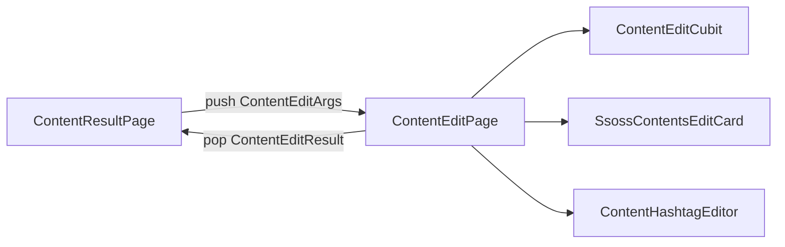

# TDD — 콘텐츠 편집 기술 설계 문서

---

## 메타 정보

| 항목 | 내용 |
|------|------|
| 기능 ID | `feature/content-edit` |
| 작성자 | ahndohyeon |
| 작성일 | 2026-07-23 |
| 상태 | Approved |
| 관련 PRD | [`prd.md`](./prd.md) |

---

## 1. 기능 요약

콘텐츠 생성 결과의 섹션별 편집 아이콘에서 편집 화면으로 이동한다. 대상(제목/본문/해시태그)과 채널에 따라 UI가 달라지며, dirty일 때만 수정하기가 활성화된다. 초기화는 확인 모달 후 초안을 복구한다. `수정하기`는 서버 호출 없이 결과 화면 draft에 반영한다.

**피처 경로**: `lib/features/content/`

---

## 2. 전체 데이터 흐름

```
[ContentResultPage]  — draft state (채널별 title/body/hashtags)
    ↓ 편집 아이콘
[ContentEditPage] + ContentEditCubit
    ├─ 문서/해시태그 편집 → isDirty
    ├─ 초기화 → showSsossModal → reset
    └─ 수정하기 → context.pop(ContentEditResult)
    ↓
[ContentResultPage] draft 갱신
```



---

## 3. Domain 레이어

이번 범위에서 신규 Entity / Repository / UseCase 없음. 기존 `UploadChannel`만 참조.

---

## 4. Data 레이어

신규 없음 (API 미연동).

---

## 5. Presentation 레이어

### 5.1 설계 결정

| 항목 | 결정 | 이유 |
|------|------|------|
| 상태 관리 | Cubit | 단순 로컬 편집·dirty |
| 진입 | 섹션별 단일 대상 | Figma 프레임과 일치 |
| 본문 카드 | `SsossContentsEditCard` | ADR-004: 일반 본문 |
| 결과 반영 | push/pop result | API 없이 draft 갱신 |

### 5.2 Cubit / State

| 파일 | 클래스 |
|------|--------|
| `presentation/cubit/content_edit_cubit.dart` | `ContentEditCubit` |
| `presentation/cubit/content_edit_state.dart` | `ContentEditState` |

```dart
enum ContentEditTarget { title, body, hashtags }

@freezed
class ContentEditState with _$ContentEditState {
  const factory ContentEditState({
    required ContentEditTarget target,
    SsossContentsEditDocument? document,
    @Default([]) List<String> hashtags,
    @Default([]) List<String> originalHashtags,
    required String originalPlainText,
  }) = _ContentEditState;
}
```

- dirty (title/body): `document.plainText != originalPlainText` 또는 recommendation 블록 구성 변경
- dirty (hashtags): list equality vs `originalHashtags`
- `reset()`: document.reset() 또는 hashtags = originalHashtags

### 5.3 Models

| 파일 | 설명 |
|------|------|
| `presentation/models/content_edit_args.dart` | 진입 args |
| `presentation/models/content_edit_result.dart` | pop 결과 |
| `presentation/models/content_result_draft.dart` | 결과 화면 채널별 draft |

### 5.4 Pages & Widgets

| 파일 | 역할 |
|------|------|
| `pages/content_edit_page.dart` | 편집 셸 |
| `widgets/edit/content_edit_bottom_bar.dart` | 초기화 + 수정하기 |
| `widgets/edit/content_hashtag_editor.dart` | 해시태그 입력·칩 (생성 플로우와 공유 가능) |

### 5.5 라우팅

| path | 페이지 | extra |
|------|--------|-------|
| `/content/create/result/edit` | `ContentEditPage` | `ContentEditArgs` |

### 5.6 글자/개수 제한

| 대상 | max |
|------|-----|
| 제목 | 40 |
| 본문 | 5000 |
| 해시태그/키워드 개수 | 10 |
| 해시태그/키워드 길이 | 30 |

---

## 6. API 명세

없음.

---

## 7. 에러 처리 전략

| 케이스 | 처리 |
|--------|------|
| 해시태그 한도 초과 | 추가 거부 + 토스트 |
| 잘못된 route extra | Create 페이지로 fallback |

---

## 8. 로컬 상태 & 캐싱 전략

| 항목 | 전략 |
|------|------|
| 편집 중 | Cubit 메모리 |
| 결과 draft | Result Page State |

---

## 9. 의존성 주입

페이지에서 `BlocProvider(create: (_) => ContentEditCubit(...))` — 전역 DI 불필요.

---

## 10. 테스트 계획

| 대상 | 종류 | 시나리오 |
|------|------|----------|
| ContentEditCubit | Unit | dirty / reset / addHashtag 한도 |
| ContentEditPage | Widget (선택) | CTA enabled |
